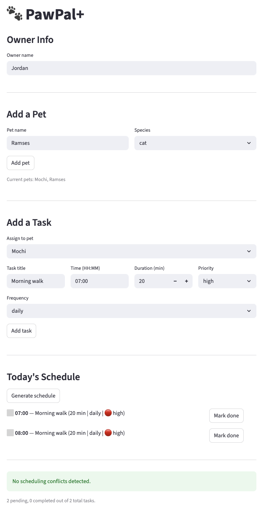

# PawPal+ 🐾

A smart pet care management system that helps owners track daily routines —
feedings, walks, medications, and appointments — while using algorithmic logic
to organize and prioritize tasks.

## Demo



## Features

- **Add multiple pets** with name and species
- **Schedule tasks** with time, duration, frequency, and priority
- **Sorted daily schedule** — tasks displayed in chronological order regardless
  of entry order
- **Conflict detection** — warns when two tasks overlap in time
- **Recurring task management** — completing a daily or weekly task automatically
  creates the next occurrence
- **Mark tasks complete** directly in the UI
- **Priority color coding** — 🔴 high, 🟡 medium, 🟢 low

## System Architecture

Four classes make up the logic layer (`pawpal_system.py`):

- `Owner` — manages a collection of pets
- `Pet` — stores pet details and its associated tasks
- `Task` — represents a single care activity (dataclass)
- `Scheduler` — the brain; retrieves, sorts, filters, and manages tasks across
  all pets

See `uml.md` for the full Mermaid.js class diagram.

## Project Structure

```
pawpal_system.py   # logic layer — all backend classes
app.py             # Streamlit UI
main.py            # CLI demo script for verifying backend logic
tests/
    test_pawpal.py # automated pytest suite
reflection.md      # design decisions and AI collaboration notes
uml.md             # Mermaid.js UML class diagram
```

## Running the App

```bash
uv run streamlit run app.py
```

## Running the CLI Demo

```bash
uv run python main.py
```

## Testing PawPal+

```bash
uv run pytest
```

The test suite covers:

- Task completion status change
- Task addition and removal from pets
- Edge case: pet with no tasks
- Sorting correctness (chronological order)
- Filtering by completion status
- Conflict detection (overlap and no-overlap)
- Recurring task creation (daily creates new instance, monthly does not)

**Confidence level: ⭐⭐⭐⭐** — all happy paths and key edge cases pass.
Integration tests and input validation are not yet covered.

## Smarter Scheduling

The `Scheduler` class implements the following algorithms:

- **Sort by time** — uses a `_time_to_minutes()` helper to parse `HH:MM` strings
  into integers, avoiding lexical sort bugs. Invalid times are placed last.
- **Conflict detection** — uses a sweep-line approach: tasks are sorted by start
  time, then each task is compared only against subsequent tasks that could
  overlap, keeping complexity close to O(n log n) for typical schedules.
- **Recurring tasks** — completing a daily or weekly task creates a new `Task`
  instance for the next occurrence rather than resetting the existing one.
  Mutation-while-iterating is avoided by collecting new tasks in a separate list
  before appending.
