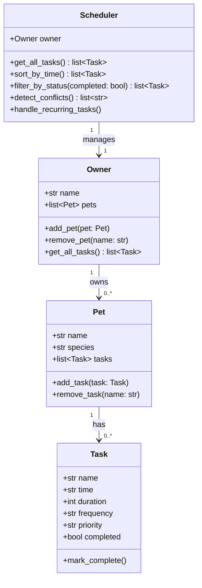

# PawPal+ UML Class Diagram

```mermaid
classDiagram
    class Owner {
        +str name
        +list~Pet~ pets
        +add_pet(pet: Pet)
        +remove_pet(name: str)
        +get_all_tasks() list~Task~
    }

    class Pet {
        +str name
        +str species
        +list~Task~ tasks
        +add_task(task: Task)
        +remove_task(name: str)
    }

    class Task {
        +str name
        +str time
        +int duration
        +str frequency
        +str priority
        +bool completed
        +mark_complete()
    }

    class Scheduler {
        +Owner owner
        +get_all_tasks() list~Task~
        +sort_by_time() list~Task~
        +filter_by_status(completed: bool) list~Task~
        +detect_conflicts() list~str~
        +handle_recurring_tasks()
    }

    Owner "1" --> "0..*" Pet : owns
    Pet "1" --> "0..*" Task : has
    Scheduler "1" --> "1" Owner : manages
```